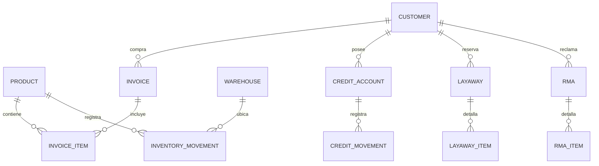

# Sistema de Inventario – Documentación Técnica Avanzada

## 1. Visión general del sistema

El **Sistema de Inventario** es una aplicación web full‑stack construida sobre **Laravel** (PHP) con **Inertia.js + React** y **Tailwind CSS** para el frontend. Su objetivo principal es gestionar de forma integral:

- Catálogo de productos y categorías.
- Stock e historial de movimientos de inventario.
- Ventas y facturación.
- Clientes (CRM básico).
- Proveedores y compras.
- Devoluciones y garantías (RMA).
- Multi‑sucursal / multi‑bodega y transferencias internas.
- Sistemas de **apartados** (layaway) y **créditos** al cliente.
- Conversión de moneda USD → BS usando una API externa de tasas de cambio.
- Integración opcional con un servicio de **IA local** para procesar imágenes.

La aplicación ofrece una **parte pública** (tienda / carrito / checkout) y un **panel administrativo** protegido por autenticación, verificación de email y roles.


## 2. Arquitectura general

### 2.1. Capas y tecnologías

- **Backend**: Laravel 10+ (PHP 8.2) sobre MySQL/MariaDB.
- **Frontend**: Inertia.js + React + Tailwind CSS.
- **Colas de trabajo**: Laravel Queue con `QUEUE_CONNECTION=database`.
- **Servicio externo de IA**: FastAPI en Python (archivo `tools/image_service.py`).
- **Integración de moneda**: Servicio `CurrencyService` que consume `https://ve.dolarapi.com/v1/dolares`.

### 2.2. Diagrama de arquitectura (propuesto)

> **Figura 1 – Arquitectura lógica**
>
> - Navegador del usuario (React + Inertia) envía peticiones HTTP al backend Laravel.
> - Laravel resuelve rutas (`routes/web.php`) y renderiza componentes Inertia.
> - Laravel accede a la base de datos MySQL a través de Eloquent (modelos en `app/Models`).
> - Operaciones intensivas o asíncronas (como procesamiento de imágenes) se delegan a **queues** (worker `php artisan queue:work`).
> - El worker se comunica con el servicio de **IA local** (`IMAGE_AI_URL`) para generar descripciones y tags.
> - El servicio `CurrencyService` consulta la API pública de tasas de cambio y provee conversión USD→BS.

_Si quieres un diagrama formal, puedes usar Mermaid, por ejemplo:_

```mermaid
graph TD
  A[Navegador (React + Inertia)] -->|HTTP| B[Laravel Backend]
  B -->|Eloquent| C[(MySQL/MariaDB)]
  B -->|Jobs| D[Laravel Queue Worker]
  D -->|HTTP JSON| E[Servicio IA (FastAPI Python)]
  B -->|HTTP| F[API de tasas USD→BS]
```


## 3. Estructura de carpetas relevante

En el proyecto (raíz `sistema_inventario`) destacan las siguientes carpetas:

- `app/Models`: modelos Eloquent del dominio (productos, facturas, movimientos, clientes, etc.).
- `app/Http/Controllers`: controladores HTTP, tanto del panel admin como del flujo público (tienda, carrito, checkout, moneda, etc.).
- `app/Services`: servicios de dominio y utilitarios, como `InventoryService` y `CurrencyService`.
- `routes/web.php`: rutas web principales (tienda, admin, API de moneda, dashboard, etc.).
- `routes/auth.php`: rutas de autenticación, registro, verificación de correo y recuperación de contraseña.
- `config/currency.php`: configuración local de la tasa BS por USD.
- `resources/views` y `resources/js` (no detallado aquí, pero contiene layouts y páginas React/Inertia).
- `tools/`: servicio de IA local construido con FastAPI y Python.
- `docs/`: documentación (incluye este documento `documentacion-sistema-inventario.md`).


## 4. Módulos funcionales principales

### 4.1. Autenticación y roles

**Archivos clave**:
- `routes/auth.php`
- Controladores en `app/Http/Controllers/Auth/*`
- `routes/web.php` (middleware `auth`, `verified`, `role:admin`)

Características:

- Registro de usuarios (`/register`) y login (`/login`).
- Verificación de email y restablecimiento de contraseña.
- Cierre de sesión (`/logout`).
- El panel admin (rutas `/admin/...` y `/dashboard`) está protegido por:
  - `auth`: el usuario debe estar autenticado.
  - `verified`: email verificado.
  - `role:admin`: sólo usuarios con rol administrador.

**Imagen sugerida (captura):** pantalla de login y dashboard con indicador de usuario autenticado.


### 4.2. Catálogo de productos y categorías

**Modelos clave**:
- `App\Models\Product`
- `App\Models\Category`
- `App\Models\ProductImage`

**Controladores**:
- `ProductController`
- `CategoryController`
- `ProductImageController`
- `ProductInventoryController` (relacionado a inventario por producto)

#### 4.2.1. Product

El modelo `Product` define un producto vendible:

- Campos (`$fillable`): `name`, `sku`, `barcode`, `description`, `price_usd`, `image_url`, `category_id`, `stock`, `is_featured`.
- Casts: `price_usd` (float), `stock` (int), `is_featured` (bool).
- Relaciones:
  - `category()`: `BelongsTo` a `Category` (categoría principal).
  - `categories()`: `BelongsToMany` a muchas categorías (clasificación flexible).
  - `movements()`: `HasMany` hacia `InventoryMovement` (historial de inventario).
  - `images()`: `HasMany` hacia `ProductImage` (galería de imágenes).
- Atributo calculado `price_bs`:
  - Lee la tasa BS desde `config('currency.bs_rate')` o `env('BS_RATE')`.
  - Devuelve el precio en bolívares redondeado a 2 decimales.

#### 4.2.2. Gestión desde el panel admin

En `routes/web.php` se definen rutas CRUD para productos y categorías bajo el grupo admin:

- Productos:
  - Listado y búsqueda: `/admin/products`.
  - Creación: `/admin/products/create` → `store`.
  - Edición: `/admin/products/{product}/edit` → `update`.
  - Importación masiva: `/admin/products/import`.
  - Eliminación: `/admin/products/{product}` (DELETE).
- Categorías:
  - Listado: `/admin/categories`.
  - Creación/edición: `/admin/categories/create`, `/admin/categories/{category}/edit`.
  - Asociaciones con productos vía relaciones Many‑to‑Many.

**Imágenes sugeridas:**
- Tabla de productos del panel admin.
- Formulario de creación/edición de producto (con categorías, precio, stock, imagen principal, etc.).


### 4.3. Inventario y movimientos

**Modelos clave**:
- `InventoryMovement`
- `MovementType`
- `Warehouse`
- `Provider`

**Servicio:**
- `App\Services\InventoryService`

`InventoryService` encapsula la lógica para registrar entradas y salidas de inventario:

- `registerEntry(Product $product, int $quantity, float $unitPriceUsd = 0, ...)`:
  - Valida que `quantity` > 0.
  - Crea un `InventoryMovement` de tipo `entry` con datos de producto, proveedor, bodega, cantidad, precio unitario y total.
  - Incrementa el `stock` del producto.
  - Todo dentro de una transacción DB (`DB::transaction`).

- `registerExit(Product $product, int $quantity, float $unitPriceUsd = 0, ...)`:
  - Valida que `quantity` > 0.
  - Verifica que el stock actual del producto sea suficiente.
  - Crea un `InventoryMovement` de tipo `exit`.
  - Decrementa el `stock` del producto.

- `summaryForProduct(Product $product): array`:
  - Calcula resumen de entradas y salidas (`entries_quantity`, `entries_total_value_usd`, `exits_quantity`, `exits_total_value_usd`).

**Flujo típico de entrada de stock** (ejemplo):

1. El usuario admin accede al detalle de inventario de un producto en `/admin/products/{product}/inventory`.
2. A través del formulario, registra una entrada (compra a proveedor, ajuste, etc.).
3. El controlador llama a `InventoryService::registerEntry`.
4. Se crea el `InventoryMovement` con referencia y notas.
5. El stock del producto se actualiza automáticamente.

**Flujo típico de salida de stock** (ejemplo):

1. Una venta o un ajuste provoca la salida de productos.
2. El controlador de facturación o inventario llama a `InventoryService::registerExit`.
3. Se valida que exista stock suficiente.
4. Se registra el movimiento `exit` y se disminuye el stock.

**Imagen sugerida:** pantalla con el historial de movimientos de un producto (fecha, tipo, cantidad, origen, bodega, usuario).


### 4.4. Multi‑sucursal / Multi‑bodega y transferencias

**Modelos**:
- `Warehouse`
- `StockTransfer`
- `StockTransferItem`

**Controladores**:
- `WarehouseController`
- `StockTransferController`

**Rutas principales (admin)**:

- Bodegas:
  - `/admin/warehouses` (listado y creación de bodegas/sucursales).
- Transferencias:
  - `/admin/transfers` (listado de transferencias de stock).
  - `/admin/transfers/create` (creación de nueva transferencia entre bodegas).
  - `/admin/transfers/{transfer}` (detalle de la transferencia y su estado).

**Flujo de transferencia de stock**:

1. El admin define bodegas (código, nombre, etc.).
2. Desde `/admin/transfers/create`, selecciona bodega origen y destino, y los productos a transferir.
3. La aplicación crea un registro `StockTransfer` y los `StockTransferItem`.
4. Se registran movimientos de inventario correspondientes (salida de la bodega origen, entrada en la bodega destino).

**Imagen sugerida:** diagrama con flechas representando transferencia de stock entre bodegas A y B.


### 4.5. Clientes (CRM) y usuarios

**Modelos**:
- `Customer`
- `User`

**Controladores**:
- `CustomerController`
- `UserController`

**Rutas (admin)**:

- Clientes:
  - `/admin/customers` (listado y creación).
  - `/admin/customers/{customer}` (detalle del cliente, historial de compras, créditos, etc.).
- Usuarios del sistema:
  - `/admin/users` (listado de usuarios internos).
  - `/admin/users/{user}` (detalle del usuario, roles, permisos básicos).

**Imagen sugerida:** ficha de cliente con datos de contacto, compras recientes, créditos y apartados activos.


### 4.6. Proveedores y cuentas por pagar

**Modelos**:
- `Provider`
- `AccountsPayable` (según nombres de modelos disponibles).

**Controlador**:
- `ProviderController`

**Rutas (admin)**:

- `/admin/providers` (listado de proveedores).
- `/admin/providers/create`, `/admin/providers/{provider}/edit`.

Los proveedores se asocian a productos y movimientos de inventario para rastrear el origen de la mercancía y soportar futuras funcionalidades de cuentas por pagar.


### 4.7. Ventas y facturación

**Modelos**:
- `Invoice`
- `InvoiceItem`
- `InvoiceStatus`
- `InvoiceContact`

**Controlador**:
- `InvoiceController`

`Invoice` agrupa la venta:

- Campos principales: `number`, `customer_id`, `status`, `invoice_status_id`, `total_usd`, `total_bs`, `warehouse_id`.
- Relaciones:
  - `customer()`: cliente asociado.
  - `items()`: líneas de detalle (`InvoiceItem`), con producto, cantidad y precio.
  - `contact()`: datos de contacto adicionales para la factura.
  - `invoiceStatus()`: estado avanzado de la factura (p. ej. pagada, pendiente, cancelada).
  - `warehouse()`: bodega donde se realizó la venta.

**Rutas (admin)**:

- `/admin/invoices` (listado de facturas).
- `/admin/invoices/create` (creación de nueva factura manual).
- `/admin/invoices` (POST para guardar).
- `/admin/invoices/{invoice}` (PUT para actualizar estado o detalles).

**Flujo simplificado de generación de factura**:

1. Desde el checkout público o desde el admin se crea un pedido.
2. Se construyen los `InvoiceItem` con precios en USD.
3. Se calcula el total en USD y BS usando la tasa vigente.
4. Se registra la factura `Invoice` con estado `pending` o `paid`.
5. Se generan salidas de inventario (`InventoryMovement` de tipo `exit`).

**Imagen sugerida:** vista de detalle de factura, con tabla de items, totales en USD/BS y estado.


### 4.8. Carrito, tienda y checkout público

**Controladores**:
- `CartController`
- `CheckoutController`

**Rutas públicas en `routes/web.php`**:

- Tienda:
  - `/` → Home (productos destacados, tasa de cambio, enlaces a login/registro).
  - `/shop` → Listado de productos con categorías y precio en USD/BS.
- Checkout:
  - `GET /checkout` → página de checkout (precio en BS calculado con `CurrencyService`).
  - `POST /checkout` → `CheckoutController@store` para procesar la compra.
  - `GET /confirmacion` → `CheckoutController@confirmation`.

**Carrito (requiere `auth`)**:

- `POST /cart/add`, `/cart/remove`, `/cart/update`, `/cart/clear`.
- `GET /api/cart` → resumen del carrito (para integrarse con el frontend React).

**Flujo de compra pública**:

1. El usuario navega por la tienda (`/shop`) y añade productos al carrito.
2. El carrito se actualiza mediante endpoints del `CartController`.
3. Al ir a `/checkout`, se muestra el resumen y se calcula el monto en BS.
4. `POST /checkout` crea el registro de venta (factura/pedido) y dispara la lógica de inventario.
5. La pantalla de `/confirmacion` muestra el resultado final.

**Imágenes sugeridas:**
- Home con productos destacados.
- Listado de tienda con filtros por categoría.
- Pantalla de checkout con resumen y totales en USD/BS.


### 4.9. Devoluciones y garantías (RMA)

**Modelos**:
- `Rma`
- `RmaItem`

**Controlador**:
- `RmaController`

**Rutas (admin)**:

- `/admin/rmas` (listado de casos de RMA).
- `/admin/rmas/create` (creación de nuevo caso de devolución/garantía).
- `/admin/rmas/{rma}` (detalle).
- `/admin/rmas/{rma}` (PUT para actualizar estado o notas).

Los RMA permiten vincular productos vendidos que son devueltos o entran en garantía. Pueden generar ajustes de inventario o notas de crédito según la configuración de negocio.

**Imagen sugerida:** pantalla de detalle RMA con motivo, productos afectados, estado y decisión (cambio, reparación, reembolso, etc.).


### 4.10. Sistema de apartados (Layaway) y créditos

**Modelos**:
- `Layaway`, `LayawayItem`.
- `CreditAccount`, `CreditMovement`.

**Controladores**:
- `LayawayController`.
- `CreditAccountController`.

**Rutas (admin)**:

- Apartados:
  - `/admin/layaways` (listado de apartados).
  - `/admin/layaways/create`, `/admin/layaways/{layaway}`, `/admin/layaways/{layaway}` (PUT).
- Créditos:
  - `/admin/credits` (listado de cuentas de crédito activas).
  - `/admin/credits` (POST para crear cuenta de crédito).
  - `/admin/credits/{account}` (detalle de una cuenta de crédito).
  - `/admin/credits/{account}/movements` (POST para registrar un movimiento de crédito: abono o consumo).

**Flujo resumido de crédito**:

1. Se crea una `CreditAccount` asociada a un `Customer` con límite de crédito y estado.
2. Cada cargo o abono se registra como `CreditMovement`.
3. El saldo (`balance_usd`) refleja los movimientos acumulados.
4. La facturación puede registrar ventas a crédito y asociarlas a la cuenta correspondiente.

**Imagen sugerida:** ficha de una cuenta de crédito mostrando límite, saldo actual, lista de movimientos y estado (activa, cerrada, suspendida).


### 4.11. Dashboard y métricas

**Ruta**: `/dashboard` (protegida por `auth`, `verified`, `role:admin`).

Desde `routes/web.php` se calculan métricas con consultas a `Invoice`, `Product`, `Rma`, `Layaway`, `CreditAccount`, etc. Entre ellas:

- Ventas de hoy y del mes en USD (`today_sales_usd`, `month_sales_usd`).
- Cantidad de facturas por estado (`pending`, `paid`, `cancelled`).
- Productos con bajo stock (<= 5 unidades).
- Stock total del catálogo.
- Conteo total de entidades (productos, categorías, proveedores, facturas, clientes, usuarios, RMA, bodegas, créditos).
- Soporte para filtrar estadísticas por `warehouse_id`.

**Imagen sugerida:** dashboard con tarjetas de métricas, gráficos de ventas, productos top, selector de bodega.


### 4.12. API de moneda USD→BS

**Servicio:** `App\Services\CurrencyService`.

Funciones clave:

- `usdToBs(float $amountUsd): float`:
  - Obtiene el promedio de la fuente `oficial` con `getPromedio`.
  - Si falla, usa `config('currency.bs_rate')` o variable de entorno `BS_RATE`.
  - Devuelve el monto en BS redondeado.

- `getPromedios(?string $apiUrl = null): array`:
  - Llama a `https://ve.dolarapi.com/v1/dolares`.
  - Interpreta la respuesta como una lista de objetos con `fuente` y `promedio`.
  - Devuelve un array asociativo `['oficial' => float, 'paralelo' => float, ...]`.

- `getPromedio(string $fuente = 'oficial', ?string $apiUrl = null): ?float`:
  - Devuelve el promedio de una fuente concreta o `null` si no existe.

**Rutas API (web)**:

- `/api/currency/promedio` → `CurrencyController@promedio`.
- `/api/currency/promedios` → `CurrencyController@promedios`.

Estas rutas se utilizan para mostrar tasas actualizadas en el frontend (home, tienda, checkout, dashboard).

**Imagen sugerida:** pequeña tarjeta en el dashboard mostrando la tasa oficial y/o paralela, con fecha/hora de actualización.


### 4.13. Servicio IA local (procesamiento de imágenes)

**Localización**: `tools/image_service.py`.

Descripción:

- Servicio FastAPI que recibe imágenes (`file`) y parámetros como `lang`, `verbose` y `tags_from_caption`.
- Genera `caption` y `tags` que pueden asociarse a productos u otros recursos.
- Se ejecuta típicamente con:

```bash
.venv\Scripts\python.exe -m uvicorn image_service:app --host 127.0.0.1 --port 8001
```

**Integración con Laravel**:

- URL configurada en `.env` mediante `IMAGE_AI_URL`.
- Los jobs de Laravel (`queue:work`) llaman al servicio IA para procesar imágenes en segundo plano.

**Imagen sugerida:** diagrama simple del flujo "subir imagen de producto → job en cola → servicio IA → guardar caption/tags".


## 5. Modelo de datos (resumen)

A continuación un resumen conceptual de las principales entidades y relaciones:

- **Product**
  - Pertenece a una `Category` principal (`category_id`).
  - Puede asociarse a múltiples `Category` mediante relación Many‑to‑Many.
  - Tiene muchas `ProductImage`.
  - Tiene muchos `InventoryMovement`.

- **Category**
  - Agrupa productos por tipo, marca, familia, etc.

- **InventoryMovement**
  - Pertenece a un `Product` y opcionalmente a un `Provider` y `Warehouse`.
  - Se clasifica como `type = entry/exit`.
  - Tiene referencia de negocio (`reference`, `movement_type_id`).

- **Invoice**
  - Pertenece a un `Customer` y a un `Warehouse`.
  - Tiene muchas `InvoiceItem`.
  - Tiene un `InvoiceStatus` y un `InvoiceContact`.

- **Customer**
  - Cliente final; se relaciona con `Invoice`, `CreditAccount`, `Layaway`, etc.

- **CreditAccount / CreditMovement**
  - Representa la línea de crédito de un cliente y los movimientos (cargos/abonos).

- **Layaway / LayawayItem**
  - Representa un apartado (reserva de productos con pagos parciales).

- **Rma / RmaItem**
  - Registra devoluciones y garantías vinculadas a ventas previas.

**Ejemplo de diagrama ER con Mermaid (simplificado):**




## 6. Flujos de negocio clave

### 6.1. Flujo de venta (tienda pública)

1. El usuario autenticado navega por `/shop` y añade productos al carrito.
2. El `CartController` mantiene el estado del carrito (add/remove/update/clear).
3. En `/checkout`, se muestra el resumen con precios en USD y BS.
4. Al confirmar, `CheckoutController@store` crea la venta (factura/pedido) y sus líneas.
5. Se actualiza el inventario mediante salidas (`InventoryService::registerExit`).
6. Se redirige a `/confirmacion` con el resultado.

### 6.2. Flujo de compra/entrada de stock (admin)

1. El admin recibe mercancía de un proveedor.
2. En `/admin/products/{product}/inventory`, registra una entrada con cantidad, costo unitario, proveedor y bodega.
3. `InventoryService::registerEntry` crea el movimiento de tipo `entry` y aumenta el stock.
4. En el dashboard se actualizan métricas de stock y costo total.

### 6.3. Flujo de crédito

1. Se crea una cuenta de crédito (`CreditAccount`) para un cliente con límite definido.
2. Cada compra a crédito o pago se registra como `CreditMovement`.
3. El saldo actual se calcula a partir de los movimientos.
4. Al llegar al límite de crédito o ante morosidad, la cuenta puede bloquearse (status).

### 6.4. Flujo de RMA

1. El cliente reporta un problema con un producto facturado.
2. El admin crea un caso RMA (`/admin/rmas/create`) asociando cliente, factura y productos.
3. Se registran decisiones (reparar, cambiar, reembolsar). Pueden generarse movimientos de inventario y notas de crédito.
4. El RMA cambia de estado (pendiente, aprobado, resuelto, cancelado).

### 6.5. Flujo de transferencia entre bodegas

1. Desde `/admin/transfers/create`, se define bodega origen, destino y productos.
2. Se crea `StockTransfer` con sus items.
3. Se ejecutan movimientos de salida e entrada en bodegas correspondientes.
4. El dashboard puede mostrar stock por bodega y transferencias recientes.


## 7. Seguridad, colas y despliegue

### 7.1. Seguridad

- Middleware de autenticación y verificación de email en rutas protegidas.
- Middleware custom `role:admin` para restringir el panel administrativo.
- Validaciones de negocio en servicios como `InventoryService` (por ejemplo, no permitir salidas sin stock).

### 7.2. Colas de trabajo

- Configuradas mediante `QUEUE_CONNECTION=database`.
- Se crean tablas para jobs con `php artisan queue:table` + `php artisan migrate`.
- Se ejecuta el worker con `php artisan queue:work --tries=3 --sleep=3`.
- Usadas para tareas que pueden ejecutarse en segundo plano (procesamiento de imágenes, notificaciones, etc.).

### 7.3. Requisitos y comandos principales

Resumen (desde `README.md`):

- PHP 8.2, Composer, Node.js + npm, MySQL/MariaDB.
- Instalación inicial:

```bash
composer install
cp .env.example .env
php artisan key:generate
npm install
php artisan migrate --force
php artisan db:seed --class=RoleSeeder
php artisan db:seed --class=DemoSeeder
php artisan storage:link
npm run dev
```

- Para el servicio de IA (en carpeta `tools`):

```bash
python -m venv .venv
.venv\Scripts\Activate.ps1
pip install -r requirements.txt
.venv\Scripts\python.exe -m uvicorn image_service:app --host 127.0.0.1 --port 8001
```


## 8. Imágenes y diagramas recomendados para el PDF

Para convertir este documento en un PDF enriquecido, se recomiendan las siguientes imágenes/capturas:

1. **Figura 1 – Arquitectura general**
   - Basada en el diagrama Mermaid de la sección 2.2.

2. **Figura 2 – Vista de Home/Tienda**
   - Captura de la página `/` o `/shop` mostrando productos, precios en USD/BS y filtro por categorías.

3. **Figura 3 – Carrito y checkout**
   - Captura del carrito con productos agregados.
   - Captura de la pantalla `/checkout` con resumen y totales.

4. **Figura 4 – Dashboard Admin**
   - Vista del `/dashboard` con métricas (ventas del día/mes, facturas por estado, stock bajo, etc.).

5. **Figura 5 – Gestión de productos**
   - Captura del listado `/admin/products`.
   - Captura del formulario de creación/edición de producto.

6. **Figura 6 – Historial de inventario por producto**
   - Captura de la vista de movimientos (entradas/salidas) para un producto.

7. **Figura 7 – Transferencia de stock entre bodegas**
   - Captura de `/admin/transfers/create` o detalle de una transferencia.

8. **Figura 8 – Crédito y apartados**
   - Captura del listado y detalle de una cuenta de crédito.
   - Captura del listado de apartados.

9. **Figura 9 – Gestión de RMA**
   - Captura de `/admin/rmas` y del detalle de un caso.

10. **Figura 10 – Panel de clientes/CRM**
    - Captura del listado `/admin/customers` y ficha de un cliente.

Con este material (este Markdown + capturas + diagramas generados), puedes abrir el archivo en VS Code, un editor Markdown o un procesador de texto, incrustar las imágenes y exportar a **PDF**.
